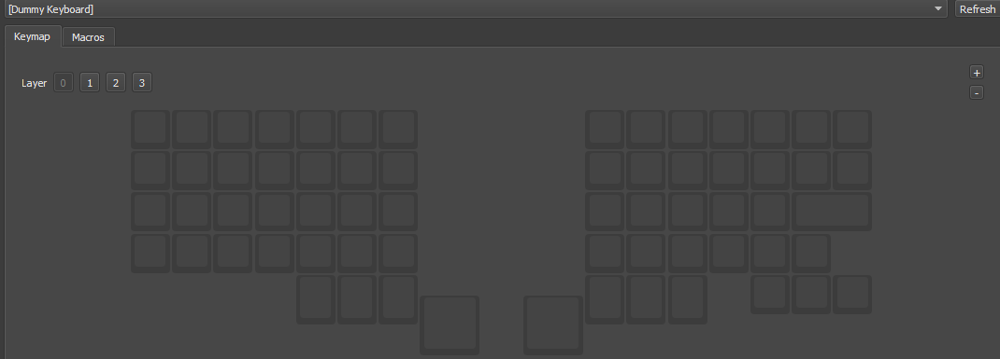
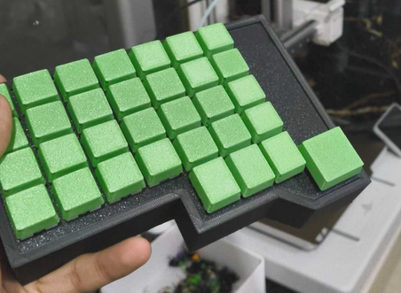

# Journal
This is a journal log of all the work put into this project :) 
Use this while designing your keyboard if you want! Take everything with a mountain of salt, I messed up a lot of stuff

## Session 1
Time Spent: 45 Minutes

So I first started designing my keyboard using Keyboard Layout Editor. I took a bunch of inspiration from existing olkbs and split keyboards, and ended up on a decent looking layout! It had basically all I needed, and it looked quite straight forward. All the keycaps are readily available, except maybe the spacebars (which are actually 2 big 1.5u squares).

I moved the layout to ai03's Plate Generator tool (which is honestly such a good tool, wow); used the default settings and exported a DXF for my plate. I brought that plate into Fusion and extruded it 1.6mm and sent it to my printer. It's important that you make sure your printer can handle the dimensional accuracy. I used a 0.12mm layer height and a 0.4mm nozzle with mostly default settings on my Bambu Lab A1.

While the printer was printing, I also checked which parts I had and which parts I needed, and bought some diodes and solid core wire from an electronics store set to arrive on the same day.

## Session 2
Time Spent: 3 Hours

Around the time the plates finished printing, the parts also arrived! I used some spare switches from a 4 year old keyboard I had, and popped them into the plate where needed. I stripped the copper wires to solder the columns, and then insulated it with tape to solder diodes. It was really really shoddy on my first attempt. I also couldn't get the stabilizer in twt. Eventually, I finished soldering the first half and soldered some dupont connectors directly to the rows/columns quite easily. They did come off a lot, and my soldering could've been better.

The thing with soldering for handwired keyboards is that it's extremely repepetive. It's easy to find yourself in a monotonous rhythym just as it is to find yourself in a flowstate.

After this, I took a small break and came back after 20 minutes to continue the other half.

## Session 3
Time Spent: 3 Hours

Armed with the new knowledge and skill on how to handwire keyboards, I started the left side of the keyboard!
I first added all of the columns, because that was the easy part. I added a small wire connecting to the space-square since it was quite straightforward.

After this, I added some tape to the parts between the switches to prevent shorting the columns and rows, and started soldering the diodes

After finishing this thing, I quickly designed a small case and printed it. However, it wsa too shallow. I printed a deeper one and let that run overnight, and it kind of fit. But once I connected the USB cable, it didn't :(
Here's a picture of the case I printed in the morning!

## Session 4
Time Spent: 2 Hours

I took the time to deepen out the cases 4mm more so that I have more headroom for the pico to be inside. I made a quick QMK firmware to see how it works, and spent the next hour reading docs and trying to find out how to do split keyboards that follow my mirrored matrix. I couldn't find that many resources, so I might just write my own code later, but I did somehow get it to show up in Vial?

Anyway I had spent too much time on QMK with no tangible results, so I took a break here.

## Session 5
Time Spent: 3 Hours

I came back and tried 2-3 times more to get QMK working, a few times without Vial included. I installed POG and KMK too, but that didn't work either. I thought that perhaps I had issues with the matrix, so I whipped up a quick matrix tester tool and that was going haywire on the right side but pretty chill on the left side so I KNOW my soldering was bad. I got enough spare switches to retry soldering the right side so I'll probably redo that.

## Session 6
Time Spent: 45 minutes

I quickly remodeled some old keycaps I had for a previous render and sent them off to the printer. After the plate finished printing for the right half I started attaching and soldering switches for that, but I need to desolder more switches from the previous attempt so I didn't complete it. After around 3 hours, all the keycaps finished printing and I am pretty proud of the result from that. Here's a picture!

## Session 7
Time Spent: 2.5 Hours

I continued soldering the new plate for the right half, and this time it turned out significantly cleaner than my first attempt. I finished that half pretty easily, although each diode took 2 minutes to solder it manually :(
I attached the keycaps and soldered both the halfs together.
I flashed the previous matrix testing software and most of the keys worked fine except the first col and the second row, so I tried to resolder that.
I then continued working on the firmware.

## Session 8
Time Spent: 30 Minutes

I worked on some more firmware using some direct slave-master trickery but failed miserably many times. I don't think circuitpython is the solution, back to QMK it is.

## Session 9
Time Spent: 2 Hours

I decided that it's okay for my keyboard to have 2 USB cables if it means I get vial, so I quickly whipped up and compiled vial firmware and flashed it, and it worked like a charm! Matrix tester helped me debug some solder connections and I swiftly fixed those, and then assembled the cases once and for all.
Here's how it turned out!

## Session 10
Time Spent: 30 Minutes

I completed the repository! I exported all the files and wrote the README to finally polish off this project :)