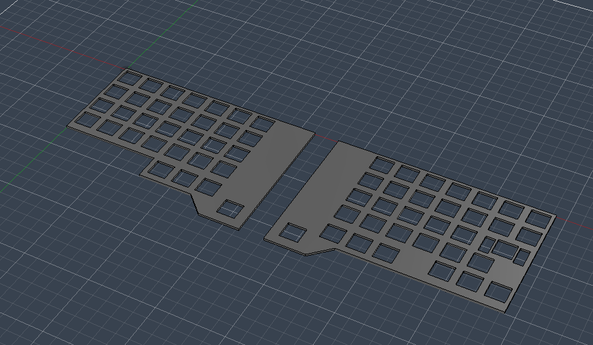
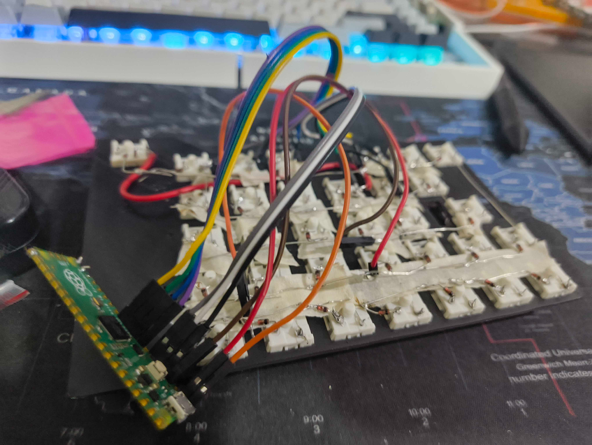
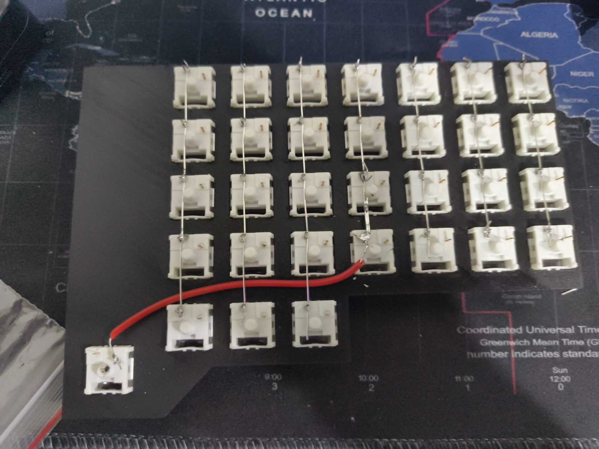
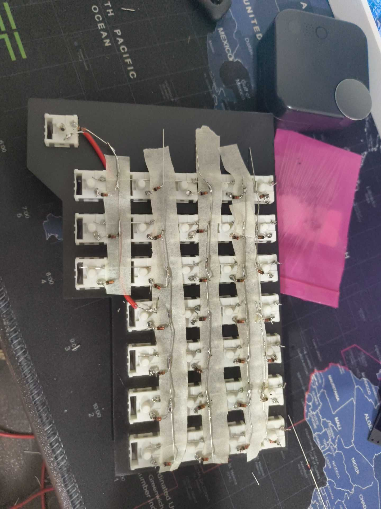
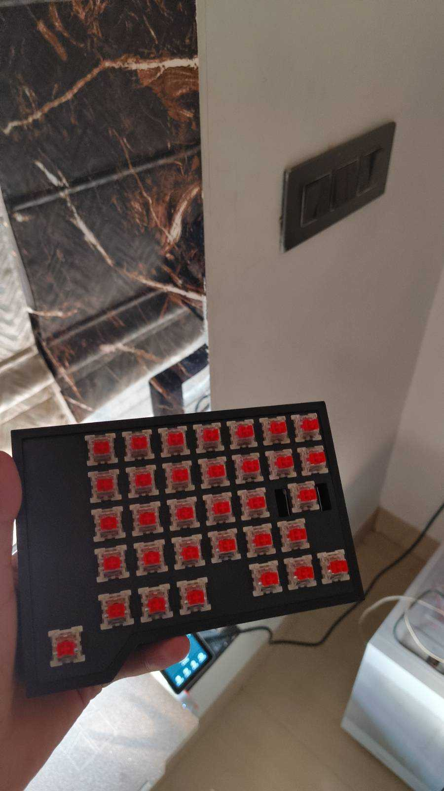

# Journal
This is a journal log of all the work put into this project :) 
Use this while designing your keyboard if you want! Take everything with a mountain of salt, I messed up a lot of stuff

## Session 1
Time Spent: 45 Minutes
So I first started designing my keyboard using Keyboard Layout Editor. I took a bunch of inspiration from existing olkbs and split keyboards, and ended up on a decent looking layout! It had basically all I needed, and it looked quite straight forward. All the keycaps are readily available, except maybe the spacebars (which are actually 2 big 1.5u squares).

I moved the layout to ai03's Plate Generator tool (which is honestly such a good tool, wow); used the default settings and exported a DXF for my plate. I brought that plate into Fusion and extruded it 1.6mm and sent it to my printer. It's important that you make sure your printer can handle the dimensional accuracy. I used a 0.12mm layer height and a 0.4mm nozzle with mostly default settings on my Bambu Lab A1.

While the printer was printing, I also checked which parts I had and which parts I needed, and bought some diodes and solid core wire from an electronics store set to arrive on the same day.

## Session 2
Time Spent: 3 Hours
Around the time the plates finished printing, the parts also arrived! I used some spare switches from a 4 year old keyboard I had, and popped them into the plate where needed. I stripped the copper wires to solder the columns, and then insulated it with tape to solder diodes. It was really really shoddy on my first attempt. I also couldn't get the stabilizer in twt. Eventually, I finished soldering the first half and soldered some dupont connectors directly to the rows/columns quite easily. They did come off a lot, and my soldering could've been better.

The thing with soldering for handwired keyboards is that it's extremely repepetive. It's easy to find yourself in a monotonous rhythym just as it is to find yourself in a flowstate.

After this, I took a small break and came back after 20 minutes to continue the other half.

## Session 3
Time Spent: 3 Hours
Armed with the new knowledge and skill on how to handwire keyboards, I started the left side of the keyboard!
I first added all of the columns, because that was the easy part. I added a small wire connecting to the space-square since it was quite straightforward.

After this, I added some tape to the parts between the switches to prevent shorting the columns and rows, and started soldering the diodes

After finishing this thing, I quickly designed a small case and printed it. However, it wsa too shallow. I printed a deeper one and let that run overnight, and it kind of fit. But once I connected the USB cable, it didn't :(
Here's a picture of the case I printed in the morning!
