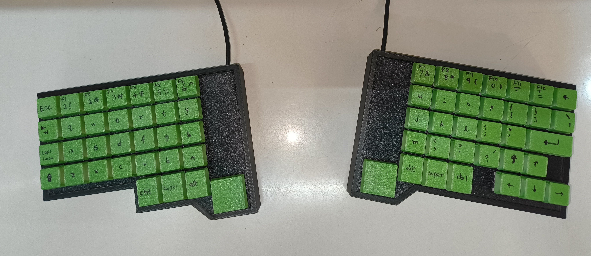
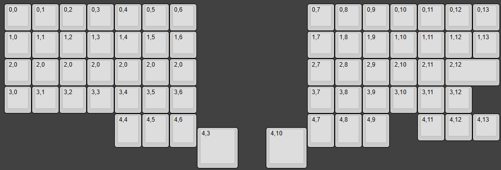

# hwsplit
handwired split keyboard with spare parts!

I made this for fun, and it is in NO WAY a functioning keyboard layout you may want to use. The function row does not work, and the backtick/tilde are also not present. There are probably going to be hundreds of flaws.

## Assembly Instructions
First of all, no idea why you'd EVER want to assembly one of these.
To begin, you must print the plates for both sides of the keyboard. I was able to do this in ~1.5 hours on my A1 in a single print. Pop your switches of choice through and wire up all the columns together. To make it easy, use solid core wire, enameled copper wire or a thin copper rod. Then, insulate the intersection points with the rows (I used masking tape) and connect the columns together. Make sure that the diodes point from the row to the switch (and subsequently to the column). Here's a sanity check for your matrix in KLE.

Solder your wires to the Microcontroller (Pico). 

On the left:
  - Rows 0 to 4 -> GP0 to GP4
  - Columns 0 to 6 -> GP11 to GP5 (Backwards)

On the right:
  - Rows 0 to 4 -> GP0 to GP4
  - Columns 7 to 13 -> GP5 to GP11 (Forwards)

Flash your code by holding BOOTSEL on the pico while plugging it into your computer. Paste corresponding `.uf2` firmware files into the new `RPI-RP2` drive on your computer. Keyboard should automatically restart and start working.

Try using Vial's matrix tester to validate your matrix using the app (https://get.vial.today/) or on the web (https://vial.rocks/). Vial on the web needs a WebHID compatible browser. This includes almost all desktop versions of chromium (Edge, Arc, Chrome, etc.).

You can then set your keys to whatever you want!

If you need visual help, you may find some images in my [Journal](JOURNAL.md),
## Keycops Needed
You will need 56x 1u keycaps, 1x 2u keycap and 6x 1.25u keycaps. The spacebar (or spaceblocks) are 2x (1.5u x 1.5u) square keycaps. These are not available anywhere to my knowledge. 

I printed all my keycaps, so it may be wise to do so.

## Overall BOM
- Soldering equipment (Iron, Solder and maybe flux)
- Solid Core copper wire / Thin Copper Rods / Enameled Copper Wire (Columns)
- Tape (any kind, I used masking/painter's tape)
- Switches (MX style, or anything that fits on an 19.05mm grid with 18mm cutouts).
- Diodes (1N4148)
- Case and Plate (I 3D printed these)
- 2x Raspberry Pi Picos
- 2x Micro USB-B Cables
- Keycaps (See above section)

Using switches from an old keyboard, the overall cost ran me about $13. I spent $5 on the wire, a little over $1 on the diodes and around $7 on the Picos.
Filament is not included in the cost, although I presume it did not take more than 500g of my daily PLA.